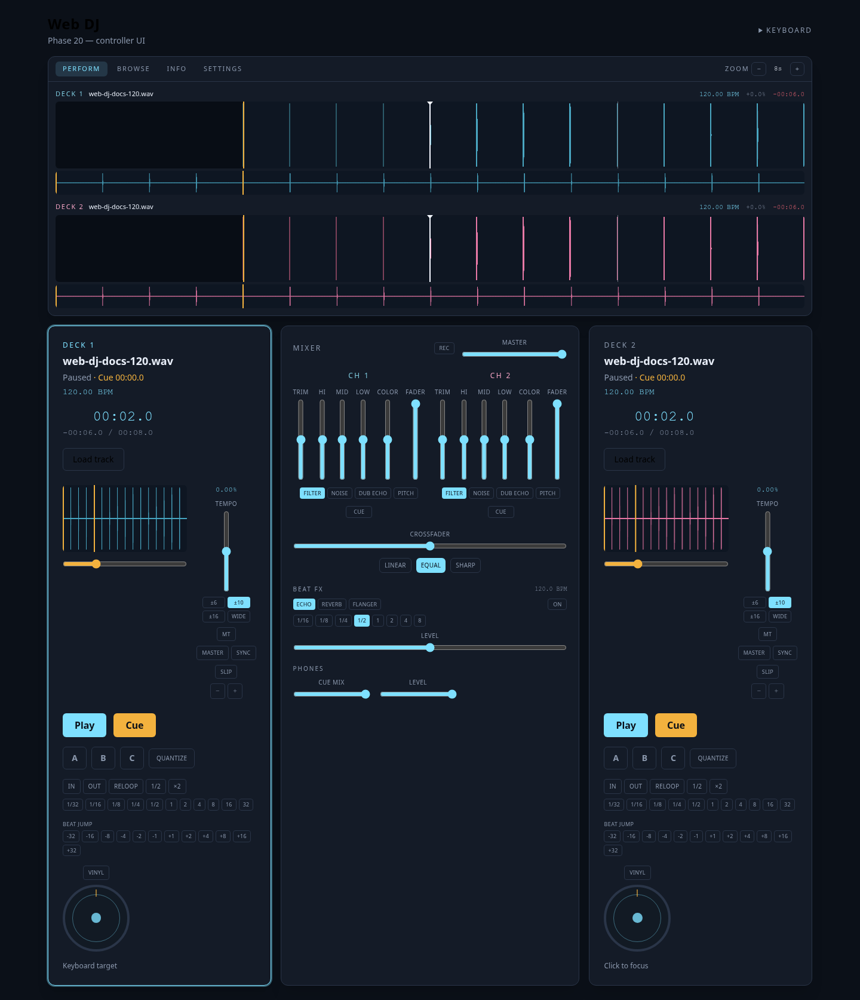
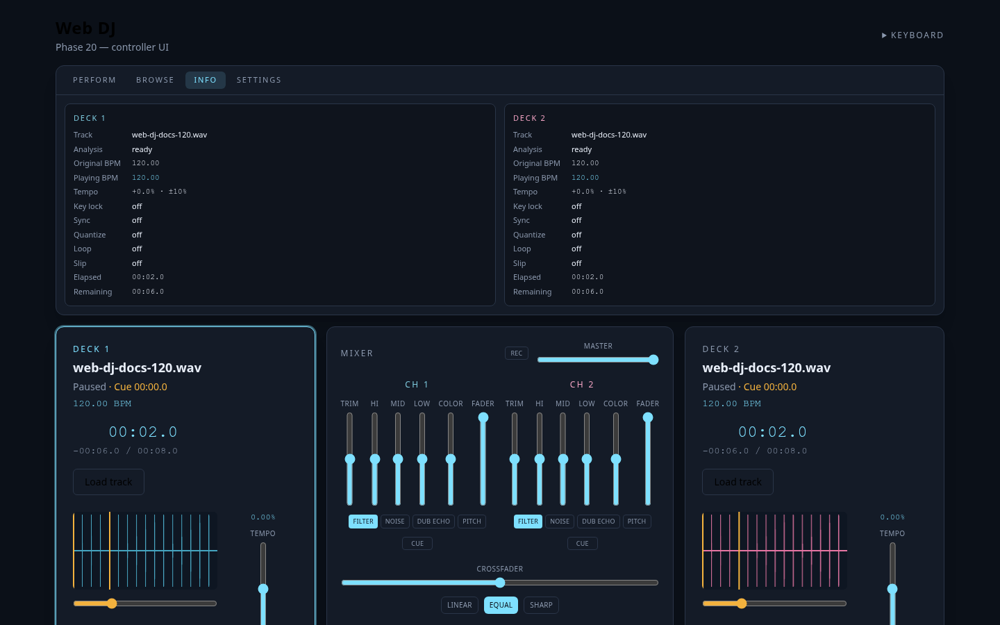

# Web DJ

A two-deck DJ workstation that runs in the browser. Load local audio, beat-match on zoomed waveforms, mix with EQ and FX, then record the master bus — without installing a native app.

Vue never owns the clock. Playback position comes from `AudioContext.currentTime`. Sample-critical work runs in AudioWorklets; BPM and waveform analysis run in a Web Worker.



<p align="center"><em>PERFORM — cyan deck 1, magenta deck 2, mixer in the centre.</em></p>

## Features

- **Two identical decks** — play, cue, tempo, sync, hot cues, loops, beat jump, slip, vinyl scratch
- **Controller display** — PERFORM, BROWSE, INFO, and SETTINGS share one screen above the hardware
- **Zoomed waveforms** — playhead stays centred; wheel to zoom 1–32 s; drag to scrub
- **Mixer** — 3-band EQ, channel faders, crossfader curves, Sound Color FX, Beat FX
- **Headphones** — pre-fader cue, cue/master mix, phones level (on one output, Cue Mix *is* what you hear)
- **Library** — import, search, sort, playlists (audio files are never stored)
- **Recording** — master-bus WebM/Opus download
- **MIDI** — generic Web MIDI map plus Learn (not a Pioneer XDJ/DDJ map)

## Quick start

Needs a Chromium-based browser (AudioWorklet, Web MIDI).

```bash
npm install
npm run dev
```

Open the printed localhost URL, click **Load track** on deck 1, then **Play**.

First mix, keyboard, and MIDI walkthrough: **[TUTORIAL.md](TUTORIAL.md)**.  
What shipped, and when: **[CHANGELOG.md](CHANGELOG.md)**.

## Display

The LCD sits above the decks so browsing a library or opening MIDI settings never unmounts the mixer.

| PERFORM | BROWSE |
| --- | --- |
|  |  |
| Playhead-centred waveforms and beat grid. | Import, search, playlists, load to deck 1 or 2. |

| INFO | SETTINGS |
| --- | --- |
|  |  |
| BPM, tempo, sync, loop, and remaining time. | Enable MIDI, Learn, restore the generic map. |

Empty platters look like this before a load:


## Keyboard

Focus a deck with **1** / **2** (cyan ring = keyboard target). Keys do nothing in text fields.

| Key | Action |
| --- | --- |
| `1` / `2` | Focus deck |
| `Space` | Play / pause |
| `C` | Cue (hold at the cue point to preview) |
| `H` | Channel cue (headphones) |
| `R` | Start / stop mix recording |
| `Q` `W` `E` | Hot cues A / B / C (`Shift` clears) |
| `T` | Quantize |
| `I` / `O` / `L` | Loop in / out / reloop |
| `,` / `.` | Loop half / double |
| `J` / `K` | Beat jump −1 / +1 |
| `Y` | Slip |
| `V` | Vinyl / CDJ jog |
| `F` | Cycle Color FX |
| `B` / `N` | Beat FX on/off / cycle type |
| `←` / `→` | Seek 1 second |
| `[` / `]` | Pitch bend (hold) |
| `M` | Master tempo |
| `S` | Sync to master |
| `G` | Make this deck the master |

Double-click a fader, knob, or the tempo slider to reset it.

## MIDI

**SETTINGS → Enable** (browser permission). Default map:

- Channel 1 = deck 1, channel 2 = deck 2, channel 16 = mixer
- Notes: C4 play, D4 cue, E4/F4/F♯4 hot cues, G4 sync, A4 headphones, B4 slip, C5 vinyl, D5–F♯5 loop, G5 quantize, A5 master tempo, B5 master deck, C3 jog touch, F2/G2/A2/B2 beat jump −4/−1/+1/+4
- CC: 1 tempo, 7 fader, 8 trim, 14 jog (relative, 64 = stop), 16–18 EQ, 19 color
- Mixer (ch 16): CC 7 master, 10 crossfader, 1 cue mix, 11 phones, 91 Beat FX level; C4 record, D4 Beat FX

**Learn** binds the next note or CC to the selected control. **Generic map** restores defaults. Bindings persist in IndexedDB.

## Architecture

```
UI (Vue)  →  DJCommand  →  CommandBus  →  AudioEngine / DeckEngine / MixerEngine
                                              ↑
                                    AudioContext.currentTime
```

- Two `DeckEngine` instances share one implementation.
- Tempo is `playbackRate` (speed and pitch together). **MT** keeps pitch with a granular overlap-add worklet.
- **SYNC** matches a slave’s effective BPM and beat phase to the master by changing tempo — it never seeks the slave.
- Analysis (peaks, BPM, grid) is worker-only and cached by file identity. Audio blobs are not stored.
- Display mode and waveform zoom live in `view.store.ts` and are never read by the engines.

Deeper behaviour (cue, slip, vinyl, FX routing) is in [TUTORIAL.md](TUTORIAL.md).

## Scripts

```bash
npm run dev          # Vite
npm run typecheck
npm run test         # Vitest
npm run test:e2e     # Playwright
npm run lint
npm run build
```
