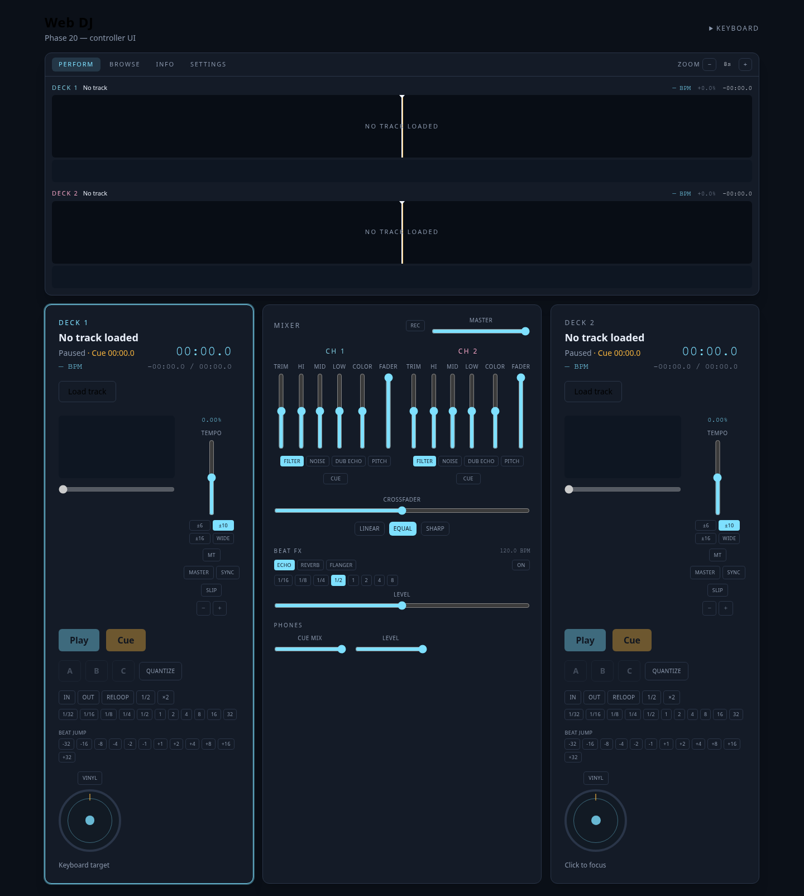
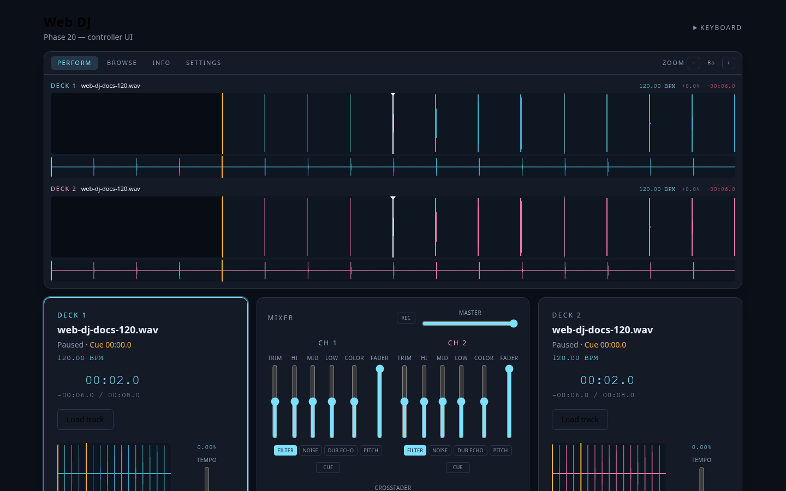
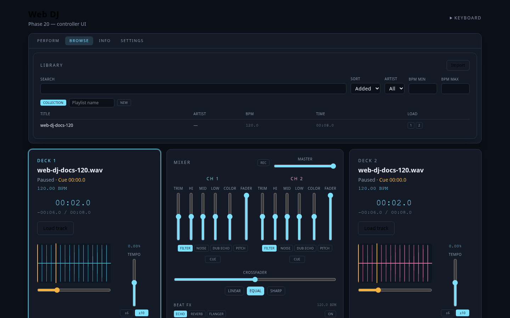
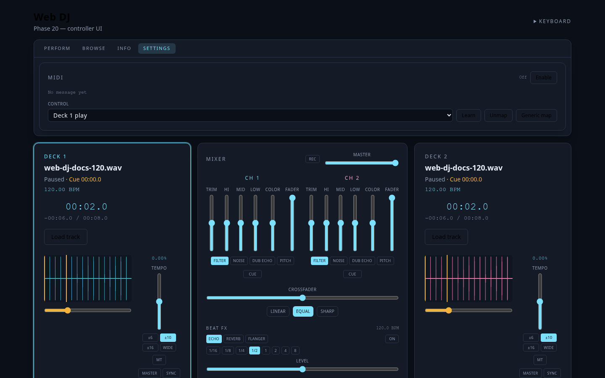

# Tutorial

A first mix in the browser, then the rest of the controller. Keys always go to the focused deck (cyan ring, or press `1` / `2`). They are ignored while a text field is focused.

## 1. Load and play

1. Run `npm run dev` and open the app.
2. On **deck 1**, click **Load track** and pick a local audio file (WAV, MP3, and anything else the browser can decode).
3. Click **Play** (or `Space`). Deck 2 stays stopped — decks are isolated.

BPM and the beat grid appear when the worker finishes. Playback is not blocked on analysis.

Load the same way on deck 2, or switch the display to **BROWSE**, **Import**, then hit **1** or **2** on a row.

Audio files are never written to IndexedDB. After a refresh, import the same files again to make library rows playable.

## 2. Cue

Memory cue on the focused deck:

- Paused away from the cue → **CUE** stores this position.
- Playing → **CUE** jumps back and pauses.
- Hold **CUE** at the cue point to preview; release to stop.

Hot cues **A / B / C** (`Q` `W` `E`) jump and play. `Shift` + pad clears. **Quantize** (`T`) snaps a new cue to the grid and delays a playing hot-cue jump until the next beat.

## 3. See the mix

**PERFORM** is the mix picture: two zoomed scrolling waveforms, playhead fixed in the centre, downbeats brighter than other beats, already-played audio dimmed.

- Drag a scrolling waveform to scrub.
- Mouse wheel over it to zoom (1–32 seconds visible).
- The thin strip under each zoomed view is the whole track.

**INFO** is the same data as numbers (BPM, tempo range, sync, remaining time). Remaining time turns red under 30 seconds.

## 4. Beat-match

1. Play deck 1 (the default **MASTER**).
2. Load deck 2, press `2`, then **SYNC** (`S`). The slave’s tempo follows the master; it does not seek.
3. Nudge with `[` / `]` (pitch bend) or the jog platter with **Vinyl** off (CDJ mode: spin = momentary bend).
4. **MT** (`M`) keeps pitch while you change tempo.

Tempo ranges: ±6, ±10, ±16, WIDE. Double-click the tempo slider to return to 0%.

**G** makes the focused deck the master.

## 5. Mix

Centre mixer, left to right mentally: trim → EQ → Color FX → fader → crossfader → Beat FX → master.

- Channel **CUE** (`H`) is pre-fader listen (after Color FX, before the fader).
- **Cue Mix**: 0 = cue bus, 1 = master, equal-power blend. On a single output this *is* the phones mix; it defaults to master so program does not change until you pull toward cue.
- Crossfader curves: Linear, Equal, Sharp. Double-click the crossfader to centre it.

### Sound Color FX

Per channel, after EQ. COLOR is bipolar (centre = off):

| Type | What you hear |
| --- | --- |
| Filter | LPF left, HPF right |
| Noise | Noise layer |
| Dub Echo | Fixed ~140 ms, not beat-synced |
| Pitch | Channel pitch shifter, not deck tempo |

`F` cycles the type on the focused deck.

### Beat FX

Master-bus insert after the crossfader: Echo, Reverb, Flanger. Times follow the **master** deck BPM and a beat fraction (1/16–8). **LEVEL** is wet/feedback. `B` toggles, `N` cycles type.

## 6. Loops, jumps, slip

- **In / Out** (`I` `O`) set a region; **Reloop** (`L`) toggles it.
- Beat loops (1/32–32) engage immediately and start playback.
- Halve / double (`,` `.`) keep the in point and move the out point.
- Beat jump ±1–32 beats (`J` / `K` are −1 / +1). Quantize delays a playing jump like a hot cue.

**Slip** (`Y`) keeps a background (logical) playhead running while a loop or held hot cue changes what you hear. Exit the loop or release the pad and audible playback jumps to that background position. Turning slip off discards the background clock without jumping.

## 7. Jog

- **Vinyl on** (`V`): touching the platter takes sample-accurate control (scratch, including reverse). Release coasts from pointer velocity, then transport resumes.
- **Vinyl off**: spin is a pitch bend, same as `[` / `]`.

## 8. Library

**BROWSE**: Import (multiple files), search, sort, artist and BPM filters, playlists. Load with the row’s **1** / **2** buttons. The chassis stays mounted — you are mix-blind on the LCD until you return to PERFORM.

## 9. Record

**Rec** on the mixer (or `R`) taps the **master** bus after Beat FX and master gain, not the phones mix. Stop downloads a WebM/Opus file named like `web-dj-mix-….webm`.

## 10. MIDI

**SETTINGS → Enable**. Generic map (channel 1 / 2 / 16), not Pioneer hardware. Pick a control, **Learn**, send a note or CC. **Generic map** restores defaults. Maps persist in IndexedDB. Vue never sees raw MIDI bytes.

Full default map: [README.md](README.md#midi).

## If something feels wrong

- No sound: raise **Master**, check channel faders and the crossfader, and that Cue Mix is not parked on an empty cue bus.
- Sync does nothing: the slave needs a beat grid (wait for BPM) and must not be the master.
- Library row won’t play after reload: import the file again — only metadata was kept.
- Jog does nothing: load a track first; vinyl vs CDJ changes what a spin means.
